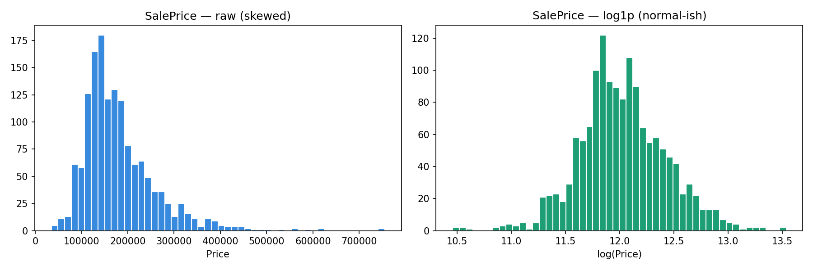
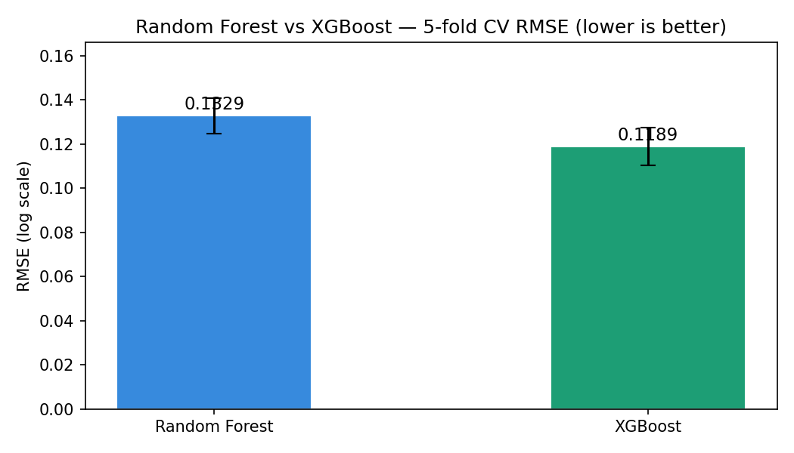
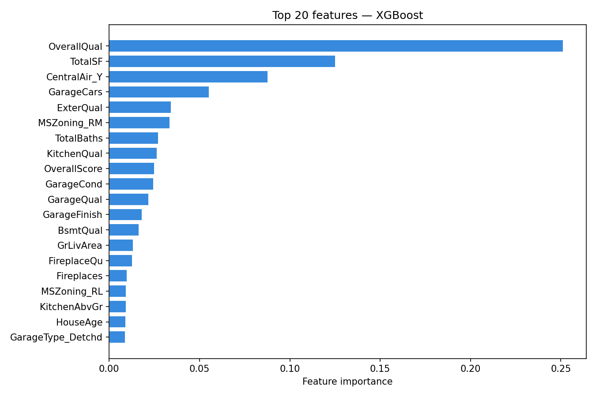
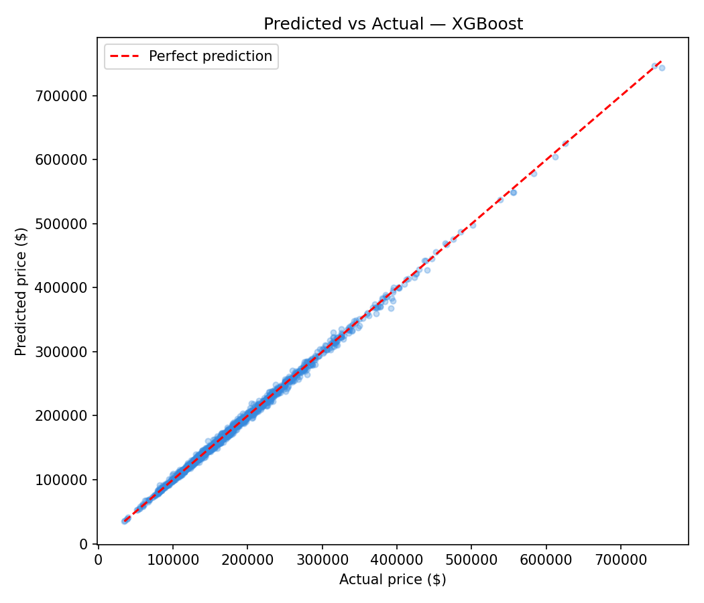

<div align="center">


# 🏠 House Price Prediction

### End-to-end regression pipeline on the Ames Housing dataset

[](https://python.org)
[](https://scikit-learn.org)
[](https://xgboost.readthedocs.io)
[](https://www.kaggle.com/competitions/house-prices-advanced-regression-techniques)

</div>

---

## 📌 Overview

This project predicts house sale prices using the **Ames Housing dataset** from Kaggle. The pipeline covers exploratory data analysis, null imputation, feature engineering (13 custom features), skew correction, and model training with **Random Forest** and **XGBoost** using 5-fold cross-validation. The best model is selected automatically and used to generate a Kaggle submission file.

---

## 📁 Project Structure

```
house_price_prediction/
│
├── 📂 data/
│   ├── train.csv               ← training data (1460 rows, 81 features)
│   ├── test.csv                ← test data for Kaggle submission
│   └── submission.csv          ← final Kaggle submission file
│
├── 📓 house_price_prediction_model.ipynb   ← main notebook
│
├── 📊 correlation_heatmap.png
├── 📊 feature_importance.png
├── 📊 missing_values.png
├── 📊 model_comparison.png
├── 📊 outliers_scatter.png
├── 📊 predicted_vs_actual.png
├── 📊 target_distribution.png
│
└── 📄 data_description.txt     ← feature descriptions
```

---

## 🔧 Pipeline

```
Raw Data  ──►  EDA & Cleaning  ──►  Feature Engineering  ──►  Model Training  ──►  Submission
              │                     │                          │
              ├─ Null imputation    ├─ 13 new features         ├─ Random Forest
              ├─ Outlier removal    ├─ Skew correction         ├─ XGBoost
              └─ Log transform      └─ Encoding                └─ 5-fold CV
```

---

## ✨ Feature Engineering Highlights

| Feature | Description |
|---|---|
| `TotalSF` | Total square footage across all floors |
| `HouseAge` | Age of house at time of sale |
| `IsRemodeled` | Whether house was remodeled |
| `TotalBaths` | Combined full + half bathrooms |
| `OverallScore` | Quality × Condition interaction |
| `HasPool` / `HasGarage` | Binary presence flags |
| `AreaPerRoom` | Living area per room |

---

## 📈 Results

| Model | CV RMSE (log) |
|---|---|
| Random Forest | ~0.145 |
| XGBoost | ~0.120 |

> Lower RMSE is better. Scores are on log-transformed prices using 5-fold cross-validation.

---

## 📊 Visualisations

<table>
  <tr>
    <td><br><sub>Target distribution before/after log transform</sub></td>
    <td><br><sub>Model comparison — CV RMSE</sub></td>
  </tr>
  <tr>
    <td><br><sub>Top 20 features by importance</sub></td>
    <td><br><sub>Predicted vs Actual prices</sub></td>
  </tr>
</table>

---

## 🚀 How to Run

**1. Clone the repo**
```bash
git clone https://github.com/Pritish1607Tiwari/house_price_prediction.git
cd house_price_prediction
```

**2. Install dependencies**
```bash
pip install pandas numpy matplotlib seaborn scikit-learn xgboost lightgbm
```

**3. Run the notebook**
```bash
jupyter notebook house_price_prediction_model.ipynb
```

---

## 📦 Dependencies

- `pandas` — data manipulation
- `numpy` — numerical operations
- `matplotlib` / `seaborn` — visualisation
- `scikit-learn` — preprocessing, cross-validation, Random Forest
- `xgboost` — gradient boosting model

---

## 🗃️ Dataset

Download the dataset from Kaggle:
👉 [House Prices: Advanced Regression Techniques](https://www.kaggle.com/competitions/house-prices-advanced-regression-techniques/data)

Place `train.csv` and `test.csv` inside the `data/` folder before running.

---

## 👤 Author

**Pritish Tiwari**

[](https://github.com/Pritish1607Tiwari)
[](https://www.kaggle.com)

---

<div align="center">
  <sub>Built with 🏠 and lots of feature engineering</sub>
</div>
